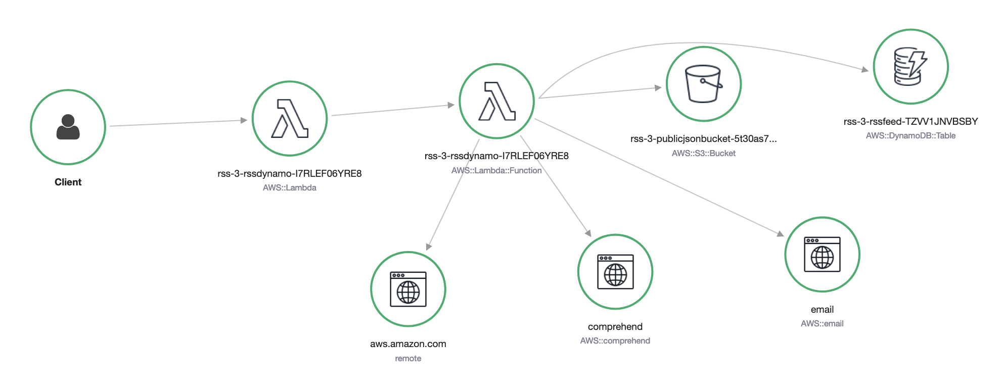

rss-lambda
==========

Monitor 40 different AWS blogs through RSS and get a notification whenever a new blog is posted. New blogposts are stored in DynamoDB and (optionally) sent out through email using SES. The Lambda function to retrieve the blogs runs every 10 minutes by default. The cost for running the solution should be less than $3 per month based on this polling frequency. 

Installation
------------

- Make sure the AWS SAM CLI and Docker are installed and configured on your local machine.
- If you want, you can edit the RSS feeds in 'lambda/feeds.txt'. These contain 40 AWS blogs by default.
- Run 'bash deploy.sh' to deploy the stack. If the 'samconfig.toml' file is not present, you will have to enter the stack details manually. 
- If you optionally select to use email notifications using SES, you will need to ensure that you have the SES sender and email address preconfigured in your account. There is unfortunately no simple way to provision this using SAM. 

Note: the 'rssdynamo' function is configured with 1GB of memory and a timeout of 30 seconds. On the initial invocation, the function will need to retrieve records from the last 72 hours and may run for up to 20-30 seconds. After the table is populated, the timeout setting can be drastically reduced, which is a best practice to prevent any unneccesary costs. 

If time allows, this will be replaced with an Express Step Function in the future, which will allow for lower default values and better visibility over the process. A Lambda concurrency limit of 1 is set for the Lambda to prevent a high amount of parallel invocations running.

About the repo contents
-----------------------

The following description describes briefly what the files and folder contains;

- The *deploy.sh* file can be used to deploy the stack to AWS. It will download all of the Lambda dependancies, pack them and upload them to S3 and deploy a CloudFormation stack using SAM. 
- The *template.yaml* file is the SAM CloudFormation stack for the deployment. You do not need to edit this file directly unless you want to change some of the default values of the stack. 
- The *lambda-dynamo* folder contains the source code for the RSS retrieval Lambda. The function also optionally sends an email through SES when new articles are retrieved. You will also find the *feeds.txt* file here that contain the RSS feeds which should be checked.
- The *lambda-layer* folder contains the *requirements.txt* file for the Lambda layer of the blog retrieval function. 

License
-------

MIT-0, please see the 'LICENSE' file for more info. 

Contact
-------

In case of questions or bugs, please raise an issue or reach out to @marekq!
